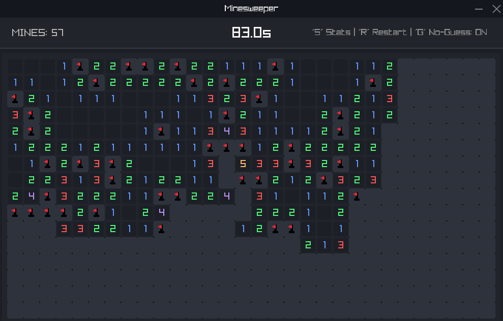

# Minesweeper

A modern Minesweeper clone built with C++ and Raylib originally designed for a programming class at my University, but upgraded to be actually useful for playing minesweeper compared to minesweeper.online!

## Online Demo

[Click to Play Online](https://liampelikan.github.io/minesweeper/)

## Controls

| Action | Control |
| :--- | :--- |
| **Reveal Cell** | Left click |
| **Toggle Flag** | Right click |
| **Reveal Adjacent** | Left click on square with correct amount of mines |
| **Restart Game** | `R` Key |
| **View Stats** | `S` Key |
| **No Guess Mode** | `G` Key |

## Download Instructions (Windows ONLY)
 - Go to "Releases" on right taskbar or click [here](https://github.com/liampelikan/minesweeper/releases/latest).
 - Download zip file, unzip and run exe file.
## Build Instructions (Windows)

### Prerequisites
- Visual Studio (2019 or newer) with C++ Support.
- [CMake](https://cmake.org/download/) (Version 3.11+).

### Build
1. Clone the repository.
2. Run `build.bat`
3. The executable will be generated at `build/Release/Minesweeper.exe`.

## License

This project is licensed under the MIT [LICENSE](LICENSE)
